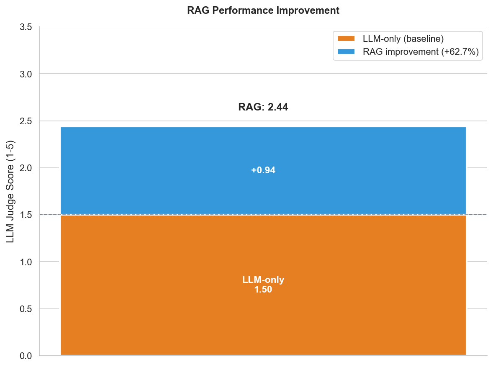

# RAG for APT Threat Intelligence

RAG (Retrieval-Augmented Generation) system for semantic search and Q&A over APT (Advanced Persistent Threat) reports.



## Requirements

- Python 3.11+
- [uv](https://docs.astral.sh/uv/)
- [Ollama](https://ollama.com) or [OpenRouter](https://openrouter.ai) API key

## Installation

```bash
uv sync
cp .env.template .env  # add HF_TOKEN
```

## Usage

```bash
# 1. Extract text from PDFs
uv run tools/extract data/reports/ data/extracted/

# 2. Generate embeddings
uv run tools/embed data/extracted/

# 3. Query the system
uv run tools/query "What TTPs does APT28 use?"
```

## Evaluation (RAG vs LLM-only)

```bash
# Benchmark (requires OPENROUTER_API_KEY in .env)
uv run tools/benchmark --mode both --model openai/gpt-oss-20b

# LLM-as-a-Judge evaluation
uv run tools/evaluate data/evaluation/benchmark.json --model openai/gpt-oss-120b

# Visualize results
uv run jupyter notebook notebooks/evaluation_results.ipynb
```

## Tests

```bash
uv run pytest
```
